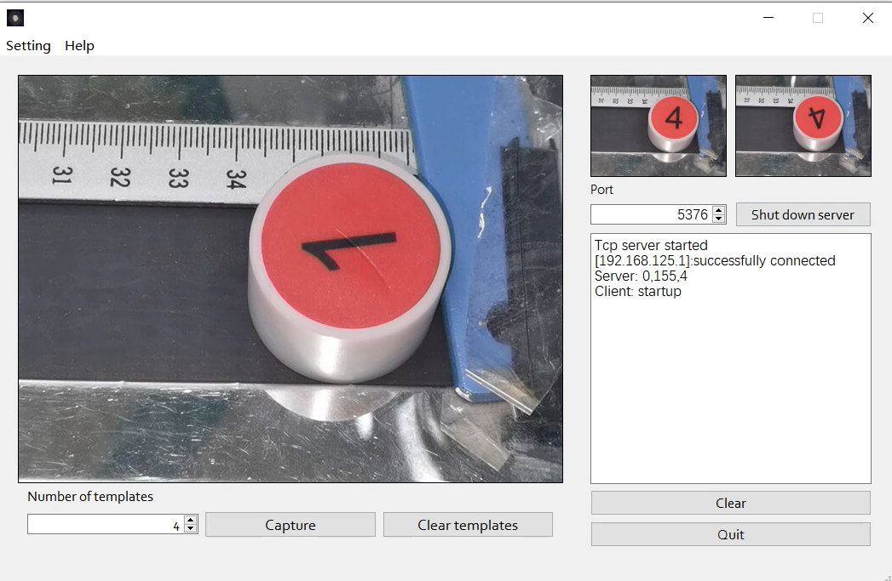
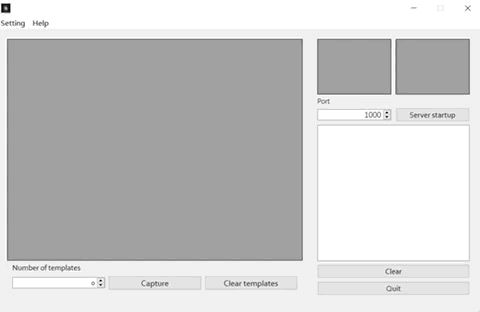

# 基于Qt与OpenCV的工业视觉检测app

### 主要功能

颜色识别，角度检测，数字识别，TCP通讯

### 主界面



包含功能：模板图片集获取，模板图片集清除，端口选择，开启端口监听，关闭端口监听，检测结果发送下位机（本次演示所用下位机为 ABB的IPB 120 型机械臂）

### 演示效果

*IP摄像头演示*



*实机演示*


### 部分源码

*主界面*

```c++
#ifndef MAINWINDOW_H
#define MAINWINDOW_H

#include <QMainWindow>
#include <opencv2/opencv.hpp>
#include <QDebug>
#include <QTimer>
#include <QTime>
#include <QString>
#include "ip_camera_setting.h"
#include <iostream>
#include <QTcpServer>
#include <QTcpSocket>
#include <QDesktopServices>
#include <QUrl>
#include "color_detector.h"
#include "angle_detector.h"
#include <QCloseEvent>
#include <QVector>
#include "contourwithdata.h"

using namespace std;

QT_BEGIN_NAMESPACE
namespace Ui { class MainWindow; }
QT_END_NAMESPACE

class MainWindow : public QMainWindow
{
    Q_OBJECT

public:
    MainWindow(QWidget *parent = nullptr);
    ~MainWindow();

    void MennBarInit(); //菜单初始化

private slots:

    void on_quit_button_clicked();  //退出按钮

    void on_clear_button_clicked(); //清除按钮

    void local_camera_open();   //打开本地摄像头

    void ip_camera_open(std::string address, std::string port);  //打开ip摄像头

    cv::Mat camera_capture(cv::Mat frame); //拍照

    void server_open_port(int port);    //服务器监听端口

    void server_accept_connection();    //服务器接受连接

    void server_send(const QString &data);  //服务器发送数据

    std::string temp( cv::Mat frame );    //临时函数
    std::string detect_color(cv::Mat imgOriginal);    //颜色检测

//    void on_test_clicked(); //测试按钮

    void on_Server_startup_clicked();

    void on_capture_clicked();

    void on_clear_templates_clicked();

protected:
    void closeEvent(QCloseEvent *event) override;

private:
    Ui::MainWindow *ui;

    QString result;

    cv::Mat frame;
    std::vector<Mat> img_template;   //用于存储模板图像
    cv::VideoCapture capture;
    std::string camera_IP, camera_port;
    cv::Mat frame_temp;
//    int num = 0;

    ip_camera_setting *ip_camera_setting_widget;

    QTcpServer *tcpServer;
    QTcpSocket *tcpSocket;

    QTimer *camera_timer;

    color_detector *col_detector;

    int template_num = 0;
//    angle_detector *agl_detector;

    Angle_detector *a;	//角度+数字识别
};
#endif // MAINWINDOW_H
```

*颜色识别*

```c++
#ifndef COLOR_DETECTOR_H
#define COLOR_DETECTOR_H

#include <QString>
#include <opencv2/opencv.hpp>
#include <iostream>

using namespace std;

class color_detector
{
public:
    color_detector(cv::Mat imgOriginal);	

    QString color_result();		//识别结果

private:
    QString color;  	//颜色编号
};

#endif // COLOR_DETECTOR_H

```


[The EXE under the debug directory can be run directly](https://github.com/zanerogl/QT_OpenCV_TCP_Detect_System/tree/main/debug)
